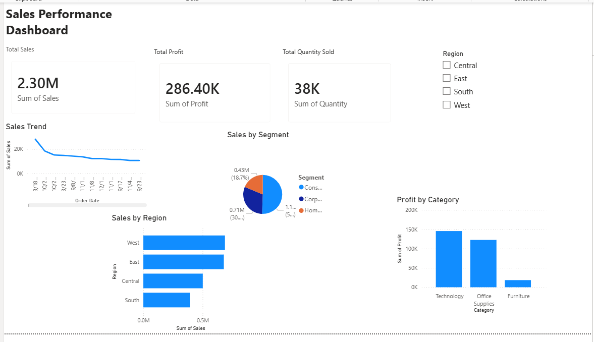

# Sales Performance Dashboard

## Overview

Interactive Sales Performance Dashboard built using Power BI and Excel to analyze sales, profit, quantity sold, regional performance, and customer segments.

## KPIs

* Total Sales: 2.30M
* Total Profit: 286.40K
* Total Quantity Sold: 38K

## Visualizations

* Sales Trend
* Sales by Segment
* Sales by Region
* Profit by Category

## Tools Used

* Power BI Desktop
* Microsoft Excel

## Key Insights

* West region generated the highest sales.
* Technology category delivered the highest profit.
* Consumer segment contributed the largest share of sales.

## Dashboard Preview

